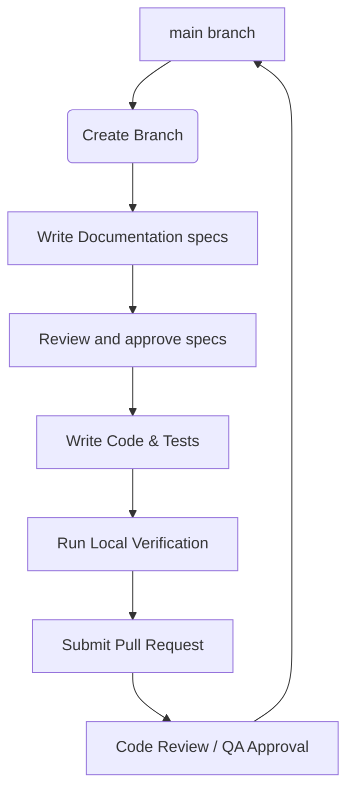

# NusaHub Contribution Guidelines

This document outlines the development workflow, branch naming policies, commit message conventions, and code review standards for the NusaHub project. All contributors—both human developers and AI agents—must adhere to these rules.

---

## 🛠️ Principles of Contribution

1. **Documentation-First (DDD)**: No feature development, architecture implementation, or design updates can begin without updating the corresponding files in the `docs/` or `ai/` folders first.
2. **Review Before Merge**: Every contribution must go through a code review and automated verification check before merging into the main branch.
3. **No Redundant Changes**: Focus on writing modular, self-contained adjustments. Avoid large refactors in feature branches unless explicitly directed by an Architectural Decision Record.

---

## 🌿 Git Workflow

We use a feature-branching Git workflow. Direct commits to `main` are strictly prohibited.



### 1. Branch Naming Convention
Branches must be prefixed based on the nature of the change, using lower-case letters and hyphens:
- `feat/` — Introducing new product features (e.g., `feat/auth-service`)
- `fix/` — Fixing a bug (e.g., `fix/token-expiration`)
- `docs/` — Documentation-only changes (e.g., `docs/architecture-update`)
- `refactor/` — Code changes that neither fix bugs nor add features (e.g., `refactor/api-client`)
- `test/` — Adding or modifying test suites (e.g., `test/unit-payment`)
- `chore/` — Build system, CI/CD, dependencies, or tool configurations (e.g., `chore/lint-setup`)

---

## 💬 Commit Message Convention

NusaHub follows the **Conventional Commits** standard. Commit messages must be structured as follows:

```text
<type>(<scope>): <description>

[optional body]

[optional footer(s)]
```

### Types
- `feat`: A new feature
- `fix`: A bug fix
- `docs`: Documentation changes
- `style`: Changes that do not affect the meaning of the code (white-space, formatting, missing semi-colons, etc.)
- `refactor`: A code change that neither fixes a bug nor adds a feature
- `perf`: A code change that improves performance
- `test`: Adding missing tests or correcting existing tests
- `chore`: Changes to the build process or auxiliary tools and libraries

### Example Commit Messages
- `feat(auth): add OTP verification service`
- `fix(wallet): resolve floating-point rounding issue in balance query`
- `docs(db): write schema documentation for user accounts`

---

## 🔍 Pull Request & Review Process

1. **Self-Review**: Prior to requesting review, the author must run local tests, code linters, and verification checks.
2. **PR Structure**: The Pull Request description must clearly detail:
   - What has been changed.
   - What documentation has been updated.
   - How the change was tested/verified.
3. **Approval**: At least one peer review (human developer or specialized reviewer agent) is required before merging.
